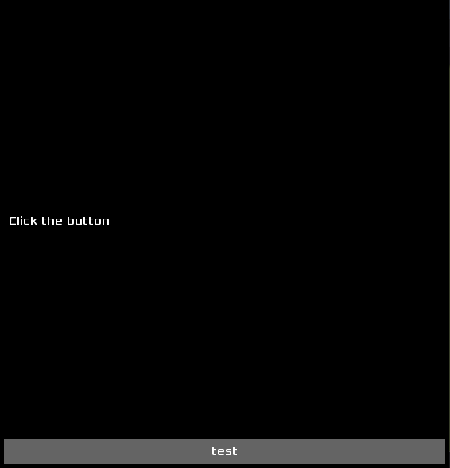

# EML - ESSA Markup Language

**EML** is a declarative language for defining GUI application layout. It is based on SerenityOS's GUI Markup Language (GML).

The example EML code looks like this:

```qml
// root object
@Application {
    main_widget: @Container { // object property
        layout: @VerticalBoxLayout {
            padding: 5 // numeric property
        }

        // child widgets
        @Textfield {
            height: auto
            content: "Click the button"
        }

        // child widget with id
        @Button submit {
            content: "test"
        }
    }
}
```

Result:



The main changes made to GML include:
* Possibility of defining widget's ID (name) just after class name, like Button in example
* Possibility of defining [custom types](#custom-types)
* New value types: `length`, `resource_id` and `range`

## Objects

The main building block of EML code is **object**. EML objects correspond to actual C++ objects that inherit from `EML::EMLObject` (see [implementing loaders]())

EML objects consists of:
* class name, which determines the C++ object that will be created 
* (*optional*) object ID
* properties, defined as key + value (e.g `layout`, `width`) (see [value types](#value-types))

## Value types

### `double`
Numeric value, corresponds to C++ `double` type.

### `bool`
Logical value, can be `true` or `false`.

```qml
enabled: true
toggleable: false
```

### `string`
A Unicode string.

```qml
content: "some string"
```

### `object`
Any EML object.

```qml
layout: @HorizontalBoxLayout
```

```qml
main_widget: @Button {
    content: "test"
}
```

### `length`
Widget size component with unit.

```qml
width: 100px    // 50.0_perc or Length{50, Length::Unit::Perc}
width: 50%      // 50.0_perc or Length{50, Length::Unit::Perc}
width: auto     // Length::Auto
width: initial  // Length::Initial
```

### `resource_id`
Resource ID, may be `asset` (uses [ResourceManager](../ResourceManager.md)) or `external` (uses filesystem paths)

```qml
image: asset("gui/newFile.png")
font: external("/usr/share/fonts/TTF/SomeFont.ttf")
```

### `range`
Numeric range

```qml
range: 0..10
```

## Custom types

You can define custom types using `define` syntax. The newly defined type must be also registered in C++.

```qml
// Add Splash type which inherits from ToolWindow
define Splash: @ToolWindow

// Add Splash type which inherits from ToolWindow and define its layout, the C++ Splash class must still be registered
define Splash: @ToolWindow {
    width: 300px // this will override C++ default

    main_widget: @Container {
        // ...
    }
}

// Instantiate Splash object
@Splash {
    // change properties
    width: 500px // this will override default specified in `define`
}
```

## Implementing loaders

You must:
* inherit from `EML::EMLObject`
* implement `EML::EMLErrorOr<void> load_from_eml_object(EML::Object const&, EML::Loader&)`

TODO...
